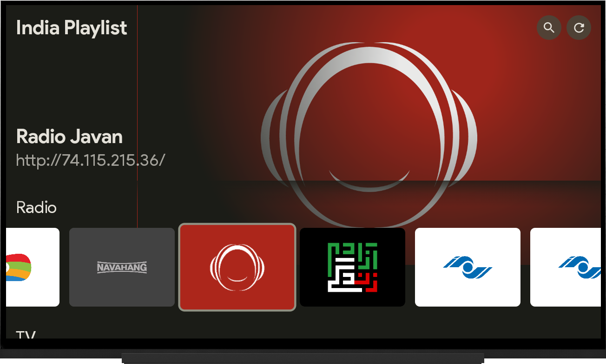
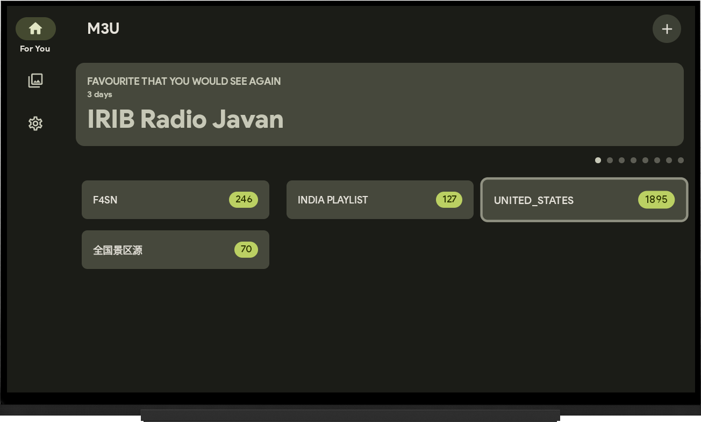

<a href="https://github.com/oxyroid/M3UAndroid">
  <picture>
   <source media="(prefers-color-scheme: dark)" srcset="https://socialify.git.ci/oxyroid/M3UAndroid/image?font=Raleway&forks=1&issues=1&logo=https%3A%2F%2Fraw.githubusercontent.com%2Foxyroid%2FM3UAndroid%2Fmaster%2Fapp%2Fsmartphone%2Ficon.png&name=1&pattern=Plus&pulls=1&stargazers=1&theme=Dark" />
   <source media="(prefers-color-scheme: light)" srcset="https://socialify.git.ci/oxyroid/M3UAndroid/image?font=Raleway&forks=1&issues=1&logo=https%3A%2F%2Fraw.githubusercontent.com%2Foxyroid%2FM3UAndroid%2Fmaster%2Fapp%2Fsmartphone%2Ficon.png&name=1&pattern=Plus&pulls=1&stargazers=1&theme=Light" />
   
    
    <source src="https://socialify.git.ci/oxyroid/M3UAndroid/image?font=Raleway&forks=1&issues=1&logo=https%3A%2F%2Fraw.githubusercontent.com%2Foxyroid%2FM3UAndroid%2Fmaster%2Fapp%2Fsmartphone%2Ficon.png&name=1&pattern=Plus&pulls=1&stargazers=1&theme=Auto" alt="M3UAndroid" width="640" height="320" />
  </picture>
</a>

**M3UAndroid** is a feature-rich streaming media player built with modern Android development practices. Perfect for phones, tablets, and TV devices, delivering a seamless viewing experience powered by Jetpack Compose.

## ✨ Key Features

- 📺 Adaptive UI for mobile & TV
- 🎭 DLNA casting support
- 🔍 Smart stream analysis
- 🌐 Xtream protocol compatibility
- 📥 Playlist management
- 🚀 Lightweight & ad-free
- 🇺🇳 Multi-language support

## 📸 Screenshots

| Mobile Experience | TV Experience |
|--------------------|---------------|
|  |  |
|  |  |
|  |  |

> TV UI is going to be remade in the future...

## ⬇️ Download Now

**Nightly Builds**: [Pre-release Packages](https://nightly.link/oxyroid/M3UAndroid/workflows/android/master/artifact.zip)

## 🛠 Tech Stack

- 100% Kotlin-first approach
- 🎨 Jetpack Compose UI toolkit
- 🧬 MVVM architecture pattern
- 🚦 Coroutines & Flows
- 🗃️ Room database
- 💉 Hilt dependency injection
- 📦 Modular architecture
- 🎥 ExoPlayer + FFmpeg core

## 🌍 Localization

Help us translate the app! Current support:

| Core Languages | Community Translations |
|----------------|------------------------|
| 🇬🇧 [English](i18n/src/main/res/values) | 🇪🇸 [Spanish](i18n/src/main/res/values-es-rES) by [@sguinetti](https://github.com/sguinetti) |
| 🇨🇳 [Simplified Chinese](i18n/src/main/res/values-zh-rCN) | 🇷🇴 [Romanian](i18n/src/main/res/values-ro-rRO) by [@iboboc](https://github.com/iboboc) |
|  | 🇪🇸 [Spanish (MX)](i18n/src/main/res/values-es-rMX) by [@sguinetti](https://github.com/sguinetti) |
|  | 🇧🇷 [Portuguese (BR)](i18n/src/main/res/values-pt-rBR) by [@Suburbanno](https://github.com/Suburbanno) |
|  | 🇹🇷 [Turkish](i18n/src/main/res/values-tr-rTR) by [@patr0nq](https://github.com/patr0nq) |
|  | 🇮🇹 [Italian](i18n/src/main/res/values-it-rIT) by [@LucaMaroglio](https://github.com/LucaMaroglio) |
|  | 🇩🇪 [German](i18n/src/main/res/values-de-rDE) by [@PhynixP](https://github.com/PhynixP) |
|  | 🇫🇷 [French](i18n/src/main/res/values-fr-rFR) by [@Gouar](https://github.com/Gouar) |
|  | 🇮🇩 [Indonesian](i18n/src/main/res/values-id-rID) by [@ca-kraa](https://github.com/ca-kraa) |
|  | 🇸🇪 [Swedish](i18n/src/main/res/values-sv-rSE) by [@optiix](https://github.com/optiix) |

## 🤝 Contribution

We welcome all contributions! Here's how you can help:
- 🐛 Report bugs via Issues
- 💡 Suggest new features
- 📝 Improve documentation
- 🔧 Submit code changes

## 📈 Project Growth

<a href="https://star-history.com/#oxyroid/M3UAndroid&Date">
  <picture>
    <source media="(prefers-color-scheme: dark)" srcset="https://api.star-history.com/svg?repos=oxyroid/M3UAndroid&type=Date&theme=dark" />
    <source media="(prefers-color-scheme: light)" srcset="https://api.star-history.com/svg?repos=oxyroid/M3UAndroid&type=Date" />
    
  </picture>
</a>

## 📜 License

Distributed under the **GPL 3.0**. See [LICENSE](LICENSE) for details.
