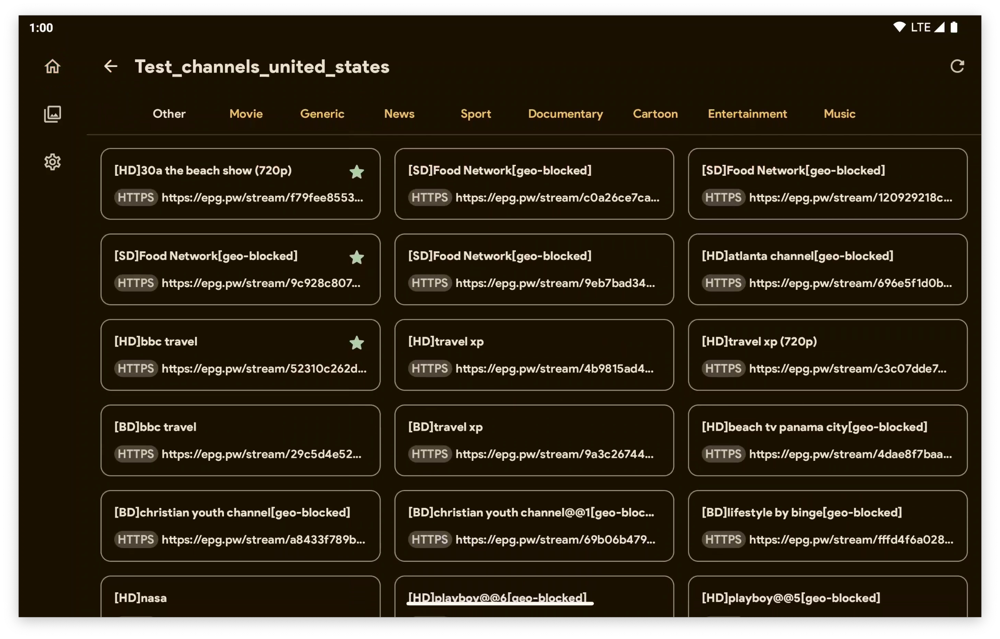
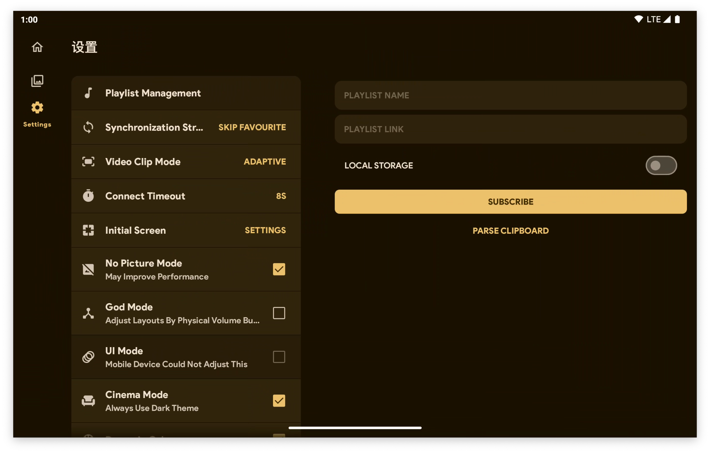

# M3UAndroid

M3U is my first elaborate Android project and is also my first jetpack compose application project.

### 📢 Translations Wanted 📢

Please submit a pull request if you want to help with translation.

Official:
- [English](i18n/src/main/res/values)
- [Simplified Chinese](i18n/src/main/res/values-zh-rCN)
- (You can also provide better translations for the above languages via pull requests)

From PRs:
- [Spanish](i18n/src/main/res/values-es-rES), thanks [@sguinetti](https://github.com/sguinetti/M3UAndroid)

### Features & Roadmap

- [x] Playlist Management.
- [x] Streaming media analysis capabilities.
- [x] Android Tablet, Desktop adaptation.
- [ ] Android TV, Car adaptation.
- [x] DLNA screencast.
- [ ] AirPlay screencast.
- [ ] Steam segment recording.
- [ ] Custom Script.
- [x] i18n.
- [ ] Multiplatform.

### Android Development

M3U is an app that attempts to use the latest libraries and tools. As a summary:

- Entirely written in Kotlin.
- UI completely written in Jetpack Compose.
- Material3 design system.
- Uses Kotlin Coroutines throughout.
- Uses many of the Architecture Components, including: Room, Lifecycle, Navigation.
- Uses Hilt for dependency injection.
- Uses Lint Checks for code scanning.
- Uses KSP & KotlinPoet for Code Generating.
- FFmepg-kit & ExoPlayer.

### Community

You can join the [Telegram Channel](https://t.me/m3u_android) for update information and **alpha &
beta packages**.

You can also join the [Telegram Group](https://t.me/m3u_android_chat) for discussing.

### Contributing

View this [file](CONTRIBUTING.md) to learn about how to contribute this repository.

Refer to the [file](RULES.md) to learn about the Code Specification of this repository.

### Star History

<a href="https://star-history.com/#realOxy/M3UAndroid&Date">
  <picture>
    <source media="(prefers-color-scheme: dark)" srcset="https://api.star-history.com/svg?repos=realOxy/M3UAndroid&type=Date&theme=dark" />
    <source media="(prefers-color-scheme: light)" srcset="https://api.star-history.com/svg?repos=realOxy/M3UAndroid&type=Date" />
    
  </picture>
</a>

### License

M3UAndroid is distributed under the terms of the Apache License (Version 2.0). See
the [license](LICENSE) for more information.
