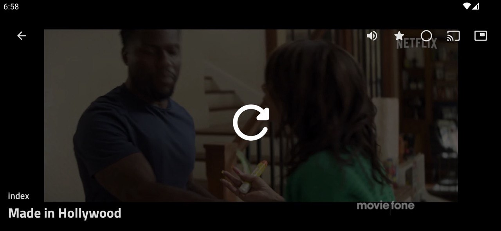

# M3UAndroid

### Features

- [x] M3U and M3U8 files.
- [x] HTTPS and RTMP stream.
- [x] Android TV.
- [ ] Android Car.
- [ ] DLNA Protocol.
- [ ] Custom Script.
- [x] i18n.
- [ ] Desktop Platform.

### Android Development

M3U is an app that attempts to use the latest libraries and tools. As a summary:

- Entirely written in Kotlin.
- UI completely written in Jetpack Compose.
- Uses Kotlin Coroutines throughout.
- Uses many of the Architecture Components, including: Room, Lifecycle, Navigation.
- Uses Hilt for dependency injection.
- Uses Lint Checks for code scanning.
- FFmepg-kit & ExoPlayer.

### Community

M3U is my first elaborate Android project and is also my first cross-platform application project.

You can join the [Telegram Channel](https://t.me/m3u_android) for update information and **alpha &
beta packages**.

### Contributing

View this [file](CONTRIBUTING.md) to learn about how to contribute this repository.

### Literatures
1. http://upnp.org/specs/av/UPnP-av-ContentDirectory-v4-Service.pdf
2. https://developer.apple.com/documentation/http-live-streaming/example-playlists-for-http-live-streaming

### About me

I am a Chinese university student who is about to graduate and eager to find a **job** in Android
Software Development,
If you are interested in offering me a job, please contact [@sortBy](https://t.me/sortBy).

### License

M3UAndroid is distributed under the terms of the Apache License (Version 2.0). See
the [license](LICENSE) for more information.
