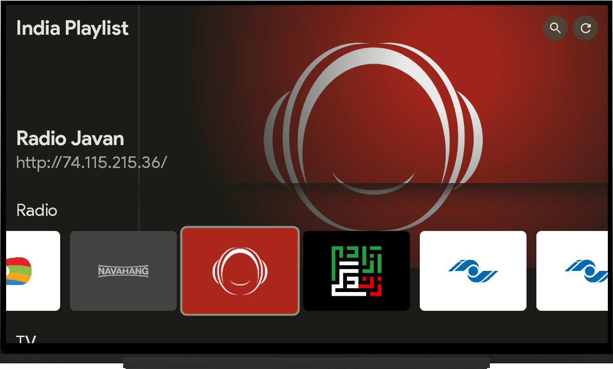

# M3UAndroid

A modern IPTV streaming player built with Jetpack Compose for Android phones, tablets, and TV devices.

## Features

- **Multi-Platform** - Optimized UI for smartphones, tablets, and Android TV
- **DLNA Casting** - Stream to compatible devices on your network
- **Smart Playback** - Advanced stream analysis and buffering
- **Protocol Support** - M3U playlists and Xtream API compatibility
- **Lightweight** - No ads, minimal permissions, efficient performance
- **Multi-Language** - Support for 12+ languages

## Screenshots

<table>
<tr>
<td width="50%">

**Mobile**

</td>
<td width="50%">

**Android TV**

</td>
</tr>
</table>

## Download

**Nightly builds** are available for [mobile](https://nightly.link/oxyroid/M3UAndroid/workflows/android/master/smartphone-apks.zip), [Android TV](https://nightly.link/oxyroid/M3UAndroid/workflows/android/master/tv-apk.zip), and [all APKs](https://nightly.link/oxyroid/M3UAndroid/workflows/android/master/artifact.zip).

M3UAndroid is not currently listed on F-Droid or IzzyOnDroid. Use the GitHub release or nightly artifacts until those repositories are available again.

For Obtainium or another automatic updater, avoid the combined archive unless the updater also has an APK filter. Use:

- Phones and tablets: the mobile nightly artifact, or GitHub release APK filter `^mobile-.*\.apk$`.
- Android TV: the Android TV nightly artifact, or GitHub release APK filter `^tv-.*\.apk$`.

Each nightly artifact includes a matching SHA-256 checksum file for verifying downloaded APKs.

## Tech Stack

- **Language** - 100% Kotlin
- **UI** - Jetpack Compose with Material Design 3
- **Architecture** - MVVM with modular structure
- **Async** - Kotlin Coroutines and Flow
- **Database** - Room
- **DI** - Hilt
- **Media** - ExoPlayer with FFmpeg integration

## Localization

Contributions welcome! Currently supporting:

- 🇬🇧 [English](i18n/src/main/res/values) · 🇨🇳 [简体中文](i18n/src/main/res/values-zh-rCN)
- 🇫🇷 [Français](i18n/src/main/res/values-fr-rFR) · 🇩🇪 [Deutsch](i18n/src/main/res/values-de-rDE)
- 🇮🇩 [Indonesia](i18n/src/main/res/values-id-rID) · 🇮🇹 [Italiano](i18n/src/main/res/values-it-rIT)
- 🇧🇷 [Português (BR)](i18n/src/main/res/values-pt-rBR) · 🇷🇴 [Română](i18n/src/main/res/values-ro-rRO)
- 🇪🇸 [Español](i18n/src/main/res/values-es-rES) · 🇸🇪 [Svenska](i18n/src/main/res/values-sv-rSE)
- 🇹🇷 [Türkçe](i18n/src/main/res/values-tr-rTR)

## Contributing

Contributions are welcome! Please feel free to submit pull requests or open issues for bugs and feature requests.

## Community

- **Telegram Channel** - [t.me/m3u_android](https://t.me/m3u_android)
- **Telegram Chat** - [t.me/m3u_android_chat](https://t.me/m3u_android_chat)

## License

This project is licensed under the [GNU General Public License v3.0](LICENSE).
